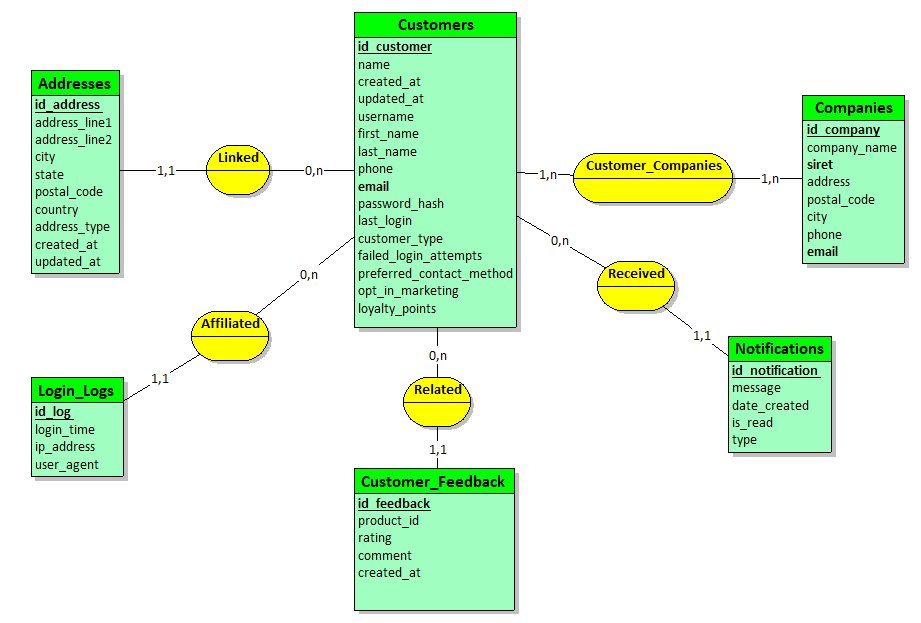
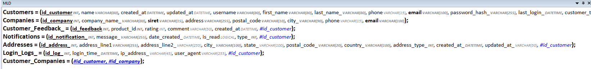

## Kawa Products API


## Participants 👥
- BILLARD Mélissa
- BRACCIALES-COMBAS Lola
- CARRILHO LAMEIRA Rita
- DIAGNE Sokhna

## Technologie 
- Api en [FastApi](https://fastapi.tiangolo.com/)

## Base de données
- [MySQL](https://www.mysql.com/fr/)

**Nom BDD** : ``customer_db``

### Création de la base de donnée
```python
## De la racine
py database/scripts/create_BDD.py
```


### Mock initial
```
https://615f5fb4f7254d0017068109.mockapi.io/api/v1/customers
```
*Liste de données de tous les clients.*


### Modèle Conceptuel de Données (MCD)


#### Modèle Logique de Données (MLD)



### Détails tables

#### Table `Customers`
- **id_customer (INT, AUTO_INCREMENT, clé primaire)** : Identifiant unique pour chaque client.
- **name (VARCHAR(80), NOT NULL)** : Nom du client.
- **created_at (DATETIME, NOT NULL)** : Date et heure de création de l'enregistrement.
- **updated_at (DATETIME)** : Date et heure de la dernière mise à jour.
- **username (VARCHAR(80), NOT NULL)** : Nom d'utilisateur du client.
- **first_name (VARCHAR(80), NOT NULL)** : Prénom du client.
- **last_name (VARCHAR(80), NOT NULL)** : Nom de famille du client.
- **phone (VARCHAR(15))** : Numéro de téléphone du client.
- **email (VARCHAR(100), NOT NULL)** : Adresse e-mail du client.
- **password_hash (VARCHAR(255), NOT NULL)** : Hash du mot de passe du client.
- **last_login (DATETIME, NOT NULL)** : Date et heure de la dernière connexion du client.
- **customer_type (INT, NOT NULL)** : Type de client (ex. : particulier, entreprise).
- **failed_login_attempts (INT)** : Nombre de tentatives de connexion échouées.
- **preferred_contact_method (INT)** : Méthode de contact préférée du client.
- **opt_in_marketing (LOGICAL)** : Indique si le client a accepté de recevoir des communications marketing.
- **loyalty_points (INT, NOT NULL)** : Points de fidélité accumulés par le client.
- **UNIQUE(email)** : Contrainte d'unicité sur l'adresse e-mail.

#### Table `Companies`
- **id_company (INT, AUTO_INCREMENT, clé primaire)** : Identifiant unique pour chaque entreprise.
- **company_name (VARCHAR(80), NOT NULL)** : Nom de l'entreprise.
- **siret (VARCHAR(15), NOT NULL)** : Numéro SIRET de l'entreprise.
- **address (VARCHAR(255), NOT NULL)** : Adresse de l'entreprise.
- **postal_code (VARCHAR(10), NOT NULL)** : Code postal de l'entreprise.
- **city (VARCHAR(90), NOT NULL)** : Ville de l'entreprise.
- **phone (VARCHAR(15))** : Numéro de téléphone de l'entreprise.
- **email (VARCHAR(100))** : Adresse e-mail de l'entreprise.
- **UNIQUE(siret)** : Contrainte d'unicité sur le numéro SIRET.
- **UNIQUE(email)** : Contrainte d'unicité sur l'adresse e-mail.

#### Table `Customer_Feedback`
- **id_feedback (INT, AUTO_INCREMENT, clé primaire)** : Identifiant unique pour chaque retour client.
- **product_id (INT, NOT NULL)** : Référence au produit concerné par le retour.
- **rating (INT)** : Évaluation du produit (ex. : 1 à 5).
- **comment (VARCHAR(50))** : Commentaire du client.
- **created_at (DATETIME)** : Date et heure de création du retour.
- **id_customer (INT, NOT NULL)** : Référence au client ayant laissé le retour.
- **FOREIGN KEY(id_customer)** : Clé étrangère qui référence `id_customer` dans la table `Customers`.

#### Table `Notifications`
- **id_notification (INT, AUTO_INCREMENT, clé primaire)** : Identifiant unique pour chaque notification.
- **message (VARCHAR(255), NOT NULL)** : Message de la notification.
- **date_created (DATETIME)** : Date et heure de création de la notification.
- **is_read (LOGICAL)** : Indique si la notification a été lue.
- **type (INT, NOT NULL)** : Type de notification.
- **id_customer (INT, NOT NULL)** : Référence au client concerné par la notification.
- **FOREIGN KEY(id_customer)** : Clé étrangère qui référence `id_customer` dans la table `Customers`.

#### Table `Addresses`
- **id_address (INT, AUTO_INCREMENT, clé primaire)** : Identifiant unique pour chaque adresse.
- **address_line1 (VARCHAR(255), NOT NULL)** : Première ligne de l'adresse.
- **address_line2 (VARCHAR(255))** : Deuxième ligne de l'adresse (optionnelle).
- **city (VARCHAR(100), NOT NULL)** : Ville de l'adresse.
- **state (VARCHAR(100))** : État de l'adresse (optionnel).
- **postal_code (VARCHAR(20), NOT NULL)** : Code postal de l'adresse.
- **country (VARCHAR(100), NOT NULL)** : Pays de l'adresse.
- **address_type (INT, NOT NULL)** : Type d'adresse (ex. : domicile, travail).
- **created_at (DATETIME, NOT NULL)** : Date et heure de création de l'enregistrement.
- **updated_at (VARCHAR(50))** : Date et heure de la dernière mise à jour.
- **id_customer (INT, NOT NULL)** : Référence au client associé à l'adresse.
- **FOREIGN KEY(id_customer)** : Clé étrangère qui référence `id_customer` dans la table `Customers`.

#### Table `Login_Logs`
- **id_log (INT, AUTO_INCREMENT, clé primaire)** : Identifiant unique pour chaque log de connexion.
- **login_time (DATETIME, NOT NULL)** : Date et heure de la connexion.
- **ip_address (VARCHAR(45))** : Adresse IP de l'utilisateur lors de la connexion.
- **user_agent (VARCHAR(255))** : User agent du navigateur ou de l'application utilisée.
- **id_customer (INT, NOT NULL)** : Référence au client ayant effectué la connexion.
- **FOREIGN KEY(id_customer)** : Clé étrangère qui référence `id_customer` dans la table `Customers`.

#### Table `Customer_Companies`
- **id_customer (INT, NOT NULL)** : Référence au client.
- **id_company (INT, NOT NULL)** : Référence à l'entreprise.
- **PRIMARY KEY(id_customer, id_company)** : Clé primaire composite qui assure l'unicité des paires client-entreprise.
- **FOREIGN KEY(id_customer)** : Clé étrangère qui référence `id_customer` dans la table `Customers`.
- **FOREIGN KEY(id_company)** : Clé étrangère qui référence `id_company` dans la table `Companies`.

## Endpoints de l'API


## Docker

1) Build container : ```docker-compose build```

2) Start container : ```docker-compose up```

## Commandes utiles
### Lancer l'api en local
```python
# Dans le fichier app
fastapi dev main.py
# ou
# À la racine
 uvicorn app.main:app --reload
```
### Effacer fichiers DS_Store
```java
find . -name .DS_Store -print0 | xargs -0 git rm -f --ignore-unmatch
```
## Tests
Librairie utilisé : [unittest](https://docs.python.org/3/library/unittest.html)
```python
pip install fastapi requests sqlalchemy
```

Exécuter les tests : 
```python
python -m unittest tests/test_api.py
```
### Tests unitaires et d'intégration


| **Test**                                | **Description**                                                                                   | **Type**        |
|-----------------------------------------|---------------------------------------------------------------------------------------------------|-----------------|
| `test_database_connection`              | Teste la connexion à la base de données.                                                         | Unitaire        |
| `test_table_customers_exists`           | Vérifie que la table `Customers` existe dans la base de données de test.                          | Unitaire        |
| `test_table_addresses_exists`           | Vérifie que la table `Addresses` existe dans la base de données de test.                          | Unitaire        |
| `test_table_companies_exists`           | Vérifie que la table `Companies` existe dans la base de données de test.                          | Unitaire        |
| `test_insert_into_customers`             | Teste l'insertion d'un client dans la table `Customers`.                                          | Intégration        |
| `test_insert_into_addresses`             | Teste l'insertion d'une adresse dans la table `Addresses`.                                        | Intégration        |
| `test_insert_into_companies`             | Teste l'insertion d'une entreprise dans la table `Companies`.                                     | Intégration        |
| `test_read_from_customers`               | Teste la lecture des données insérées dans la table `Customers`.                                  | Unitaire        |
| `test_update_customers`                  | Teste la mise à jour d'un client dans la table `Customers`.                                       | Intégration        |
| `test_delete_from_customers`             | Teste la suppression d'un client dans la table `Customers`.                                       | Intégration        |
| `test_read_from_addresses`               | Teste la lecture des données insérées dans la table `Addresses`.                                  | Unitaire        |

#### Rapport de test en format XML
```python
pytest --junitxml=report.xml
```
#### Rapport de test en format HTML
```python
coverage run -m unittest discover
coverage report
coverage html
```

