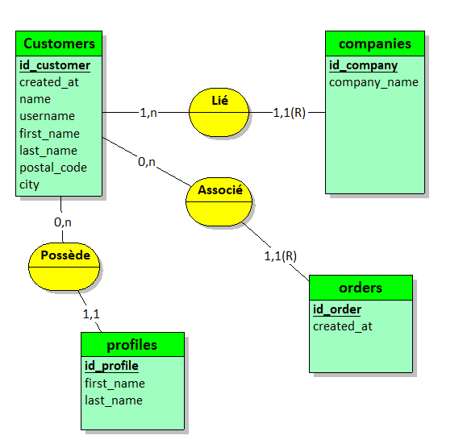
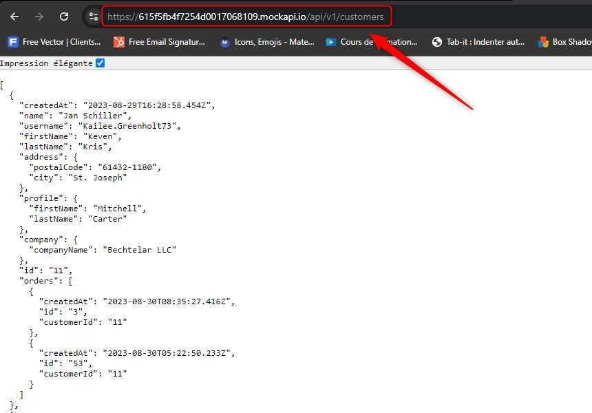

## Kawa Products API 

## Participants 👥
- BILLARD Mélissa
- BRACCIALES-COMBAS Lola
- CARRILHO LAMEIRA Rita

## Technologie 
- Api en [FastApi](https://fastapi.tiangolo.com/)

## Endpoints de l'API


## Docker

1) Build container : ```docker-compose build```

2) Start container : ```docker-compose up```


## Commandes utiles
### Effacer fichiers DS_Store
```java
find . -name .DS_Store -print0 | xargs -0 git rm -f --ignore-unmatch
```


## Tables de la base de données

### Base de données 
- MySQL 

Nom : customer_db

### Modèle conceptuel de données (MCD)


### Mock 


### Table customers

id (VARCHAR, clé primaire) : Identifiant unique du client.

created_at (DATETIME) : Date de création du client.

name (VARCHAR) : Nom complet du client.

username (VARCHAR) : Nom d'utilisateur du client.

first_name (VARCHAR) : Prénom du client.

last_name (VARCHAR) : Nom de famille du client.

postal_code (VARCHAR) : Code postal de l'adresse.

city (VARCHAR) : Ville de l'adresse.

### Table profiles

id (VARCHAR, clé primaire) : Identifiant unique du profil.

customer_id (VARCHAR, clé étrangère) : Référence à l'identifiant du client.

first_name (VARCHAR) : Prénom du profil.

last_name (VARCHAR) : Nom de famille du profil.

### Table companies

id (VARCHAR, clé primaire) : Identifiant unique de l'entreprise.

customer_id (VARCHAR, clé étrangère) : Référence à l'identifiant du client.

company_name (VARCHAR) : Nom de l'entreprise.

### Table orders

id (VARCHAR, clé primaire) : Identifiant unique de la commande.

customer_id (VARCHAR, clé étrangère) : Référence à l'identifiant du client.

created_at (DATETIME) : Date de création de la commande.
